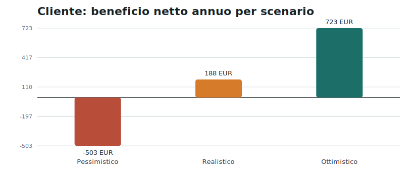
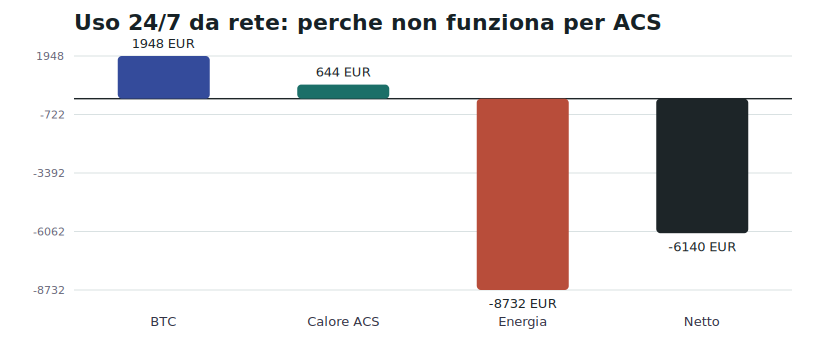
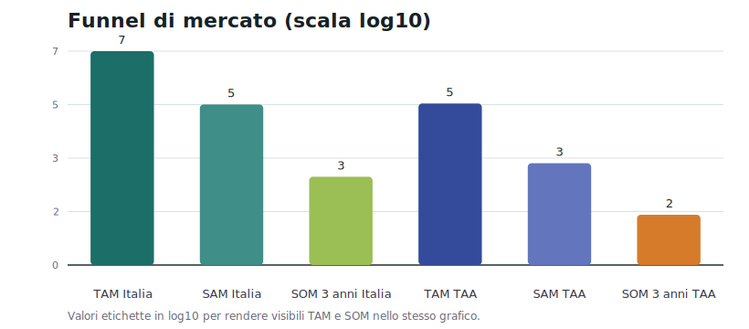
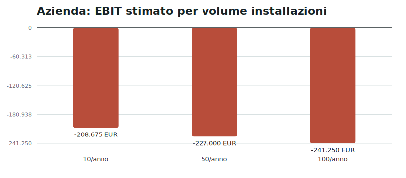

# Startup ASIC Heat Recovery per ACS domestica

**Report di fattibilita - focus Italia e Trentino-Alto Adige**  
Data analisi: 2026-06-21

## 1. Executive summary

**Verdetto sintetico:** l'idea e tecnicamente fattibile, ma **non e una startup scalabile interessante se il cliente tipo e la famiglia media che vuole solo acqua calda sanitaria (ACS)**. Il recupero del calore funziona; il problema e economico e di product-market fit: un ASIC moderno da 3.56 kW produce molta piu potenza termica del fabbisogno ACS medio, mentre il mining con elettricita retail italiana e strutturalmente negativo.

La tesi diventa piu credibile solo in una nicchia: clienti con fotovoltaico, surplus non valorizzato, alto fabbisogno termico continuo e tolleranza verso Bitcoin/mining. In Trentino-Alto Adige il target iniziale migliore non e la famiglia media, ma **agriturismi, B&B, piccole strutture ricettive e case indipendenti di Bitcoiner con FV**, dove ACS, lavanderia, riscaldamento integrativo, spa/piscina o accumuli piu grandi aumentano le ore termiche utili.

- **Sostenibilita dell'idea:** si, come integrazione impiantistica di nicchia; no, come prodotto domestico generalista ACS-only.
- **Vantaggi:** recupero di calore altrimenti disperso; narrativa forte per Bitcoiner; possibilita di usare surplus FV; differenziazione rispetto a heater aria.
- **Rischi principali:** payback cliente debole, stagionalita e sottoutilizzo ACS, prezzo/difficulty BTC, responsabilita installativa, rumore/sicurezza elettrica, CAC alto.
- **Probabilita di successo:** **28/100** per startup B2C domestica ACS-only; **45/100** se riposizionata su piccoli clienti con alto carico termico e FV.
- **Capitale iniziale consigliato:** minimo **EUR 250k-400k** per prototipo, 5-10 piloti e certificazioni/assicurazioni di base; **EUR 800k-1,5M** se si sviluppa hardware proprietario, opzione sconsigliata all'inizio.

## 2. Analisi tecnica

Il sistema base usa un ASIC SHA-256 come generatore elettrico-termico: quasi tutta l'energia assorbita diventa calore. Il calore viene trasferito a un circuito idraulico tramite air-to-water, waterblock/hydro o immersione, passa in uno scambiatore e carica un accumulo ACS. Una centralina decide quando minare in base a temperatura accumulo, disponibilita FV, prezzo energia, limiti elettrici e allarmi.

| Componente | Funzione | Costo indicativo | Fornitori/produttori |
| --- | --- | --- | --- |
| ASIC SHA-256 | Genera hash e calore quasi pari all'energia elettrica assorbita. | EUR 1.400-2.000 air S21; EUR 4.000-8.000 modelli recenti/hydro | Bitmain, MicroBT, Canaan; rivenditori UE come 21Energy |
| Recupero calore | Convoglia o trasferisce il calore ASIC verso circuito acqua. | EUR 600-2.500 retrofit air-to-water/hydro; EUR 2.000-5.000 immersione | DCX, Engineered Fluids, Fog Hashing, fornitori HVAC custom |
| Scambiatore a piastre | Separa circuito miner da ACS/accumulo e trasferisce potenza termica. | EUR 150-600 | Alfa Laval, SWEP, Caleffi, Reflex |
| Boiler/accumulo | Stocca ACS e riduce cicli on/off del miner. | EUR 700-2.000 | Cordivari, Ariston, Vaillant, Viessmann, Austria Email |
| Pompe/valvole/sensori | Circolazione, anticondensa, sicurezza, miscelazione anti-scottatura. | EUR 300-900 | Grundfos, Wilo, Caleffi, Honeywell/Resideo |
| Quadro elettrico | Linea dedicata, protezioni, sezionamento, misura, gestione carichi. | EUR 500-1.200 | ABB, Schneider Electric, Gewiss, Finder |
| Monitoraggio software | Controlla temperatura, hash, consumi, allarmi, wallet/pool non custodial. | EUR 200-800 setup + EUR 5-20/mese | Braiins OS, LuxOS, Home Assistant, Node-RED, Hiveon |

**Architettura A - integrazione componenti esistenti:** e la sola strada sensata per i primi 18-24 mesi. Si compra un ASIC CE/UE o importato con documentazione, si integra con componenti idraulici certificati e si vende progettazione, installazione, monitoraggio e manutenzione. Prototipo realistico: EUR 20k-40k; 5 piloti: EUR 80k-150k.

**Architettura B - hardware proprietario:** aumenta il controllo sul prodotto, ma sposta la startup in una traiettoria industriale costosa: progettazione termica/elettrica, CE/EMC/LVD/RED, prove di sicurezza, firmware, tooling, inventory, garanzia e assistenza. NRE realistico: EUR 500k-1,5M prima di avere un prodotto vendibile. Non va fatta prima di aver dimostrato domanda pagante.

**Criticita tecnica maggiore:** per una famiglia da 3 persone assumo 2300 kWh/anno utili di ACS. Con recupero 85%, il miner deve consumare circa 2706 kWh/anno, cioe solo 760 ore/anno. Un ASIC da 3,56 kW usato 24/7 consuma invece 31.186 kWh/anno: per ACS pura la maggior parte del calore sarebbe inutilizzata.

## 3. Analisi di mercato

I dati GSE 2024 indicano **1.875.870 impianti FV in Italia**, di cui **1.604.513 residenziali**. In Trentino-Alto Adige risultano **50.297 impianti FV totali** e **38.772 residenziali**: Bolzano 10.671 residenziali, Trento 28.101.

| Area | TAM tecnico stimato | SAM realistico | SOM 3 anni | Base stima |
| --- | --- | --- | --- | --- |
| Italia | 6.500.000 | 80.000-180.000 | 300-1000 | TAM stimato: case con impianto ACS individuale e spazio tecnico; SAM derivato da 1,60M FV residenziali GSE filtrati per casa indipendente, surplus FV, quadro elettrico e interesse BTC. |
| Trentino-Alto Adige | 140.000 | 1000-2500 | 20-60 | SAM derivato da 38.772 impianti FV residenziali GSE nelle province di Bolzano e Trento, con filtro severo su compatibilita tecnica e disponibilita ad acquistare. |

| Segmento | Dimensione mercato | Capacita di spesa | Probabilita acquisto | Valutazione |
| --- | --- | --- | --- | --- |
| Possessori FV | Molto alta | Media-alta | Media | Miglior filtro iniziale, ma solo se esiste surplus o autoconsumo non valorizzato. |
| Bitcoiner | Bassa-media | Alta | Media-alta | Comprano la narrativa, ma spesso preferiscono miner puro o DIY. |
| Case indipendenti | Alta | Media | Bassa-media | Necessarie per spazio, rumore, canna/ventilazione e quadro elettrico. |
| Early adopter tecnologici | Media | Alta | Media | Buoni piloti, ma CAC alto e aspettative di prodotto elevate. |
| Agriturismi/piccole strutture | Media | Alta | Media-alta | Target migliore se hanno ACS continuativa, lavanderia, piscina/spa o accumuli maggiori. |

**Classifica target iniziali:**

1. **Agriturismi e piccole strutture ricettive con FV e ACS elevata** - miglior target, perche aumentano le ore termiche utili e possono giustificare manutenzione/monitoraggio.
2. **Bitcoiner con casa indipendente e FV** - acquisto emozionale/ideologico piu probabile, ma mercato piccolo.
3. **Case indipendenti con boiler elettrico e surplus FV** - payback possibile solo in scenario ottimistico.
4. **Early adopter tecnologici** - utili per piloti, non sufficienti per scalare.
5. **Famiglia media senza FV** - target da evitare.

## 4. Concorrenza

| Competitor | Prezzo | Caratteristiche | Punti di forza | Punti deboli |
| --- | --- | --- | --- | --- |
| Heatbit Trio | USD 849 | 10 TH/s, 400 W mining + 1.100 W resistenza; aria, purificatore | Prodotto consumer semplice, app e brand | Non recupera calore in ACS; hashrate basso; stagionale |
| Heatbit Maxi Pro | USD 1.499 | Fino a 60 TH/s, 1.500 W calore mining; aria, purificatore | Buon benchmark consumer plug-in | Solo riscaldamento ambiente, non idraulico |
| 21Energy Ofen 2 | EUR 1.780-1.940 | Fino a 40 TH/s, 1.000 W, <45 dB | Prodotto UE, silenzioso, app, prezzo chiaro | Non ACS; rendimento economico limitato |
| 21Energy Ofen 2 Pro | EUR 2.240-2.410 | Fino a 60 TH/s, 1.100 W, <45 dB | Segmento premium europeo | Resta un heater ambiente |
| RY3T ONE | Non pubblicato | Modulo in impianto termico esistente, 7-14 kW termici dichiarati | Competitor piu vicino al concept idronico | Alta potenza: piu adatto a case grandi/strutture; rischio installazione e CAPEX |

La concorrenza diretta sui boiler idronici e ancora limitata. Heatbit e 21Energy validano l'idea "heater + mining", ma restano prodotti aria/ambiente. RY3T e piu vicino all'idea di integrazione termica domestica, con potenze dichiarate 7-14 kW: questa e una conferma della direzione tecnica, ma anche un segnale che il mercato naturale potrebbe essere riscaldamento/impianto termico, non ACS-only.

## 5. Modello economico cliente

Assunzioni principali:

- ASIC: Bitmain Antminer S21 200 TH/s, 200 TH/s, 3.56 kW, prezzo mercato UE circa EUR 1950.
- BTC al 2026-06-21: EUR 55.889; hashrate rete: 937,5 EH/s.
- Ricavo mining a condizioni correnti: circa EUR 1948 lordi/anno se l'ASIC resta acceso 24/7; circa EUR 62 per MWh elettrico consumato.
- ACS famiglia media modellata: 2300 kWh/anno utili; miner acceso solo per coprire ACS: 760 ore/anno.

| Scenario | Costo impianto | Consumo elettrico miner | Costo energia | BTC minati (valore) | Risparmio energia termica | Beneficio netto annuo | Payback |
| --- | --- | --- | --- | --- | --- | --- | --- |
| Pessimistico | EUR 9000 | 2706 kWh | EUR 866 | EUR 110 | EUR 253 | EUR -503 | Mai |
| Realistico | EUR 7900 | 2706 kWh | EUR 487 | EUR 169 | EUR 506 | EUR 188 | 42 anni |
| Ottimistico | EUR 6500 | 2706 kWh | EUR 216 | EUR 296 | EUR 644 | EUR 723 | 9 anni |

Conclusione cliente: anche nello scenario realistico il payback e circa **42 anni**. Lo scenario ottimistico scende sotto 10 anni, ma richiede simultaneamente FV surplus a basso costo opportunita, boiler elettrico come baseline, hashprice favorevole e installazione sotto EUR 6.500. Se il cliente scalda ACS con pompa di calore o gas efficiente, il valore termico scende e il payback peggiora drasticamente.

## 6. Modello economico azienda

Distinta base realistica per integrazione non proprietaria:

| Voce | Costo |
| --- | --- |
| Materiali totali | EUR 6300 |
| Installazione diretta | EUR 850 |
| Progettazione/commissioning | EUR 450 |
| Riserva assistenza | EUR 250 |
| Costo diretto totale | EUR 7850 |
| Prezzo installato ipotizzato | EUR 8900 |
| Margine lordo unitario | EUR 1050 (11,8%) |

| Installazioni/anno | Ricavi | Margine lordo | Opex annui | Utile/EBIT | EBIT margin |
| --- | --- | --- | --- | --- | --- |
| 10 | EUR 90.500 | EUR 11.325 | EUR 220.000 | EUR -208.675 | -230,6% |
| 50 | EUR 455.000 | EUR 58.000 | EUR 285.000 | EUR -227.000 | -49,9% |
| 100 | EUR 915.000 | EUR 118.750 | EUR 360.000 | EUR -241.250 | -26,4% |

L'azienda non copre una squadra minima ai volumi 10-50/anno e resta fragile anche a 100/anno. Con il margine unitario calcolato qui, il break-even e oltre **300 installazioni/anno**; anche portando il margine a EUR 2.000 servirebbero circa 140-180 installazioni/anno. Aumentare il prezzo sopra EUR 10.500 migliora l'azienda, ma peggiora il payback cliente. Questo e il conflitto centrale del business model.

## 7. Team necessario

| Ruolo | Competenze | Costo annuo lordo/fully loaded |
| --- | --- | --- |
| Founder / business development | Vendita tecnica, partnership installatori, fundraising, gestione piloti | EUR 55k-80k |
| Ingegnere energetico / termotecnico | Schemi ACS, dimensionamento accumuli, sicurezza, pratiche, DICO/relazioni | EUR 65k-90k |
| Elettricista/installatore lead | Linee dedicate, protezioni, commissioning, coordinamento idraulico | EUR 45k-65k |
| Sviluppatore software/IoT | Telemetria, app, allarmi, firmware, integrazione pool/wallet non custodial | EUR 55k-85k |

Primo anno consigliato: founder full-time, termotecnico part-time/consulente, installazione in subcontract, software contractor. Assumere tutta la squadra prima di 20-30 piloti paganti brucia capitale senza prova di domanda.

## 8. Aspetti normativi

- **Marcatura CE:** obbligatoria per apparecchi immessi sul mercato UE quando ricadono nelle direttive applicabili. Per un sistema proprietario si applicano almeno bassa tensione, compatibilita elettromagnetica e, se radio/Wi-Fi integrati, RED; possibili RoHS/ecodesign e valutazioni su pressione/macchine a seconda dell'architettura.
- **Impianti in edificio:** in Italia l'installazione elettrica e idraulica deve essere eseguita da imprese abilitate con dichiarazioni di conformita. La startup deve vendere tramite installatori qualificati o diventarlo.
- **Sicurezza elettrica:** un carico continuo da 3-6 kW richiede linea dedicata, protezioni, sezionamento, controllo temperatura, verifica potenza contrattuale e spesso aumento kW/monofase-trifase.
- **ACS:** servono miscelatore antiscottatura, valvole di sicurezza, vaso espansione, prevenzione legionella, materiali idonei acqua sanitaria e gestione temperature.
- **Responsabilita legale:** rischio incendio/allagamento, danni da surriscaldamento ASIC, garanzia su componenti modificati, assicurazione RC prodotti/installazione.
- **Mining:** il mining domestico non e vietato in se, ma i proventi possono avere rilevanza fiscale. La startup deve evitare custodia BTC o gestione centralizzata dei wallet per non entrare in rischi AML/finanziari; meglio configurazione non custodial, account pool intestato al cliente.

## 9. Go-to-market

| Fase | Durata | Costo | KPI |
| --- | --- | --- | --- |
| Prototipo tecnico | 0-3 mesi | EUR 20k-40k | COP termico effettivo verso accumulo >80%; spegnimento sicuro; telemetria stabile 30 giorni |
| Cliente pilota | 3-6 mesi | EUR 30k-70k | 1-3 siti, zero incidenti, ore utili termiche >700/anno proiettate, NPS tecnico positivo |
| Primi 10 clienti | 6-12 mesi | EUR 120k-220k | CAC < EUR 1.500, margine lordo >20%, tempo installazione <2 giorni, ticket assistenza <1/mese/sito |
| Espansione TAA/Nord Italia | 12-24 mesi | EUR 250k-500k | 50+ installazioni cumulative, partnership 3-5 installatori, churn manutenzione <5%, casi studio pubblici |

Canali consigliati: installatori FV/termotecnici locali, community Bitcoin italiane, associazioni agriturismi, fiere energia/ospitalita, casi pilota documentati con dashboard pubblica. Evitare advertising B2C largo prima di avere payback dimostrato su clienti ad alto carico termico.

## 10. Verdetto finale

- **Probabilita di successo:** 28/100 come ACS domestico B2C; 45/100 se riposizionato su piccoli utenti con alto carico termico.
- **Capitale minimo necessario:** EUR 250k-400k per provare il modello integratore; EUR 800k-1,5M per hardware proprietario, sconsigliato prima della validazione.
- **Miglior target iniziale:** agriturismi/B&B/case indipendenti premium in Trentino-Alto Adige con FV, boiler/accumulo, ACS elevata e proprietario favorevole a Bitcoin.
- **Principali rischi:** economia cliente debole, potenza ASIC sovradimensionata per ACS, volatilita BTC/difficulty, responsabilita impiantistica, customer acquisition cost, installazioni non standard.
- **Raccomandazione:** procedere solo con **pilota integrato e misurato**, non con sviluppo hardware. La metrica di stop/go deve essere: almeno 5 clienti paganti con beneficio netto dimostrato > EUR 600/anno o disponibilita a pagare non basata sul solo ROI. Se i piloti familiari non raggiungono questa soglia, spostare il prodotto verso carichi termici maggiori o chiudere il caso business.

## Fonti e note

| Fonte | Uso nel report | Link |
| --- | --- | --- |
| GSE | Fotovoltaico Italia 2024, impianti totali/residenziali e dati Bolzano/Trento | https://www.gse.it/dati-e-scenari/statistiche |
| GSE allegato XLSX | Fonte numerica estratta: 1.875.870 impianti FV totali, 1.604.513 residenziali; TAA 50.297 totali, 38.772 residenziali | https://www.gse.it/documenti_site/Documenti%20GSE/Rapporti%20statistici/GSE%20-%20Solare%20fotovoltaico%202024%20-%20Allegato.xlsx |
| CoinGecko API | BTC EUR 55.889 / USD 64.118 al 2026-06-21 | https://api.coingecko.com/api/v3/simple/price?ids=bitcoin&vs_currencies=usd,eur |
| mempool.space | Hashrate corrente 937,5 EH/s e difficulty 124.932.866.006.548 | https://mempool.space/api/v1/mining/hashrate/3d |
| Heatbit | Prezzi e caratteristiche Trio / Maxi Pro | https://heatbit.com/products/heatbit-trio |
| 21Energy | Prezzi e caratteristiche Ofen 2 / Ofen 2 Pro / Antminer S21 | https://21energy.com/products/ofen-2 |
| RY3T | Sistema idronico RY3T ONE, range dichiarato 7-14 kW | https://ry3t.com/ |
| UE CE marking | Obblighi generali marcatura CE | https://europa.eu/youreurope/business/product-requirements/labels-markings/ce-marking/index_en.htm |
| ARERA | Quadro regolatorio energia e riferimento per offerte/tariffe elettriche | https://www.arera.it/ |

Le stime TAM/SAM/SOM non sono dati pubblicati: sono derivate dai dati FV GSE e da filtri operativi su compatibilita tecnica, profilo cliente e probabilita di acquisto. Le tariffe elettriche usate negli scenari sono ipotesi operative conservative/realistiche/ottimistiche; nella vendita reale vanno sostituite con bolletta, contratto FV e valore di esportazione del singolo cliente.
